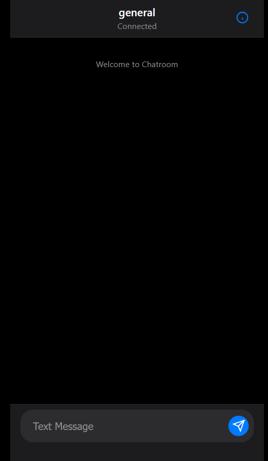
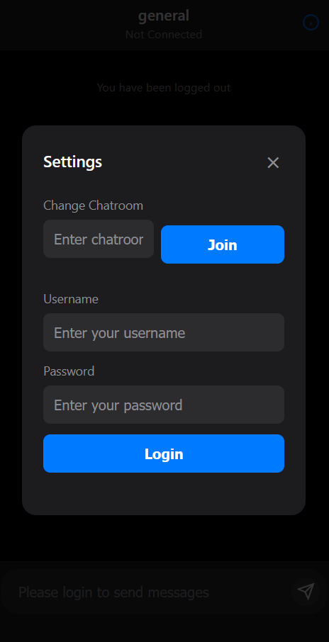

# 💬 Lowkey Chatroom

A real-time web-based chatroom built using **Golang**, **WebSockets**, and **OpenSSL**, with a clean, mobile-friendly UI inspired by iMessage. This app supports multi-user messaging across rooms, WebSocket-based communication, user login, and session management.



---

## Sections
- [Features](#-features)
- [Technologies Used](#-technologies-used)
- [Project Structure](#-project-structure)
- [Getting Started](#-getting-started)
- [Sample Users](#-sample-users)
- [How It Works](#-how-it-works)
- [Future Improvements](#future-improvements)
- [Screenshots](#-screenshots)
- [Contributions](#-contributions)
- [License](#-license)

---

## ⚙️ Features

- 🧠 Built in **Go** using the `net/http` and `gorilla/websocket` packages
- 🔐 Secure login using **OpenSSL**-generated OTPs (JWT/session-less)
- 🔁 Concurrent message handling using **Goroutines**
- 🪢 **WebSocket-based** real-time messaging
- 👥 Multiple chatrooms (rooms can be joined dynamically)
- 📲 Responsive chat UI with iOS-style layout
- 🌙 Dark mode aesthetics
- 🚪 Logout/login flow with UI control

---

## 🧪 Technologies Used

| Layer        | Tech/Library         |
|--------------|----------------------|
| Backend      | Go, Gorilla WebSocket |
| Concurrency  | Goroutines, Channels |
| Security     | OTPs, OpenSSL        |
| Frontend     | HTML, CSS (iOS style), Vanilla JS |
| Deployment   | HTTPS-ready, WebSocket TLS support |

---

## 📁 Project Structure

```
chatapp/
├── .gitignore
├── Dockerfile
├── LICENSE
├── README.md
├── client.go
├── event.go
├── frontend
    └── index.html
├── gencert.bash
├── go.mod
├── go.sum
├── main.go
├── manager.go
├── otp.go
├── screenshot.png
├── screenshots
    ├── chat.png
    └── login.png
```

---

## 🚀 Getting Started

### 1. Clone the Repository

```bash
git clone https://github.com/thatquietkid/websockets-project-golang.git
cd websockets-project-golang
```

### 2. Generate SSL Certificate (if not already)

```bash
sudo apt update
sudo apt install openssl
mkdir cert
bash gencert.sh
```
> Change apt to your system's package manager (e.g., yum, dnf).

### 3. Run the Server

Using Go:
```bash
go build .
go run main.go
```

Using Docker:

```docker
docker build -t chatapp .
docker run -p 8080:8080 chatapp
```

> The server starts on `https://localhost:8080`.

---

## 🧪 Sample Users

> You can mock login with any username/password combo. OTP or JWT-based login expected in production.
```
Current user: admin
Password: admin1234
```

---

## 🧵 How It Works

- User logs in via a login form
- Server issues a one-time token (OTP) or JWT (via `/login`)
- A WebSocket is established at `/ws?otp=...`
- All messages are routed through WebSocket events (`send message`, `new_message`, `change_room`)
- The frontend handles dynamic rendering and displays messages in real-time

---

## Future Improvements

- Persistent storage (messages are in-memory only for now!)
- Real authentication backend (mock login for now!)
- Rate limiting

---

## 📸 Screenshots

| Login | Chat View |
|-------|-----------|
|  |  |

---

## 🤝 Contributions

Feel free to fork the repo, file issues, and submit PRs. All feedback is welcome!

---

## 📜 License

MIT License © 2025 [Nitin Chauhan](LICENSE)